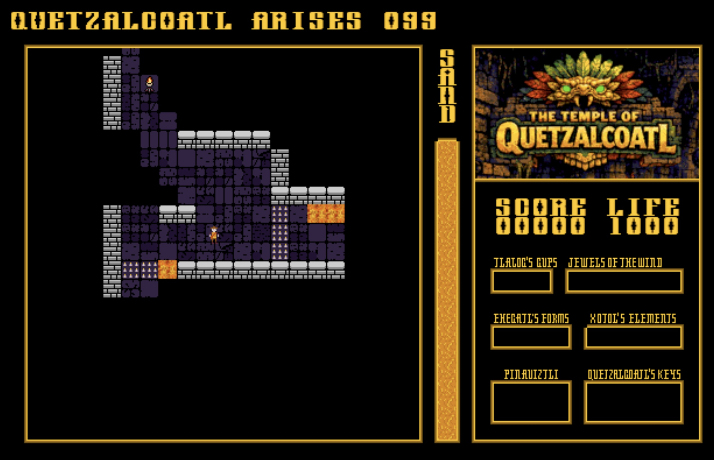

# The Temple of Quetzalcoatl
A Commander X16 game written in 6502 assembly.

## Gameplay
You run around multiple interconnected levels of a temple looking for treasure while avoiding traps and searching for exits. You can drop a limited supply of sand to mark areas you've been to and help navigate the complex temple.

## Features
The main feature is the line-of-sight "realtime" lighting. As you move around, areas out of your line-of-sight are not visible. I put it in quotes because it does update at the full 60fps, but all of it is pre-calculated and stored in extended RAM.

